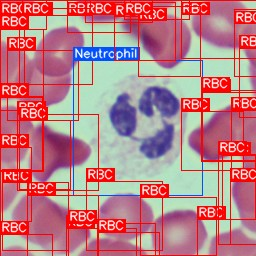
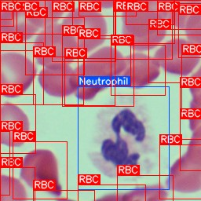
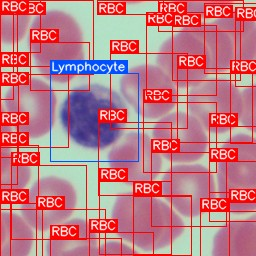
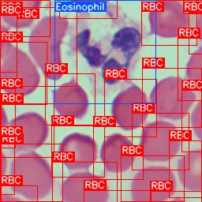
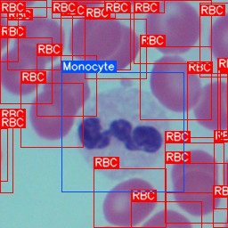
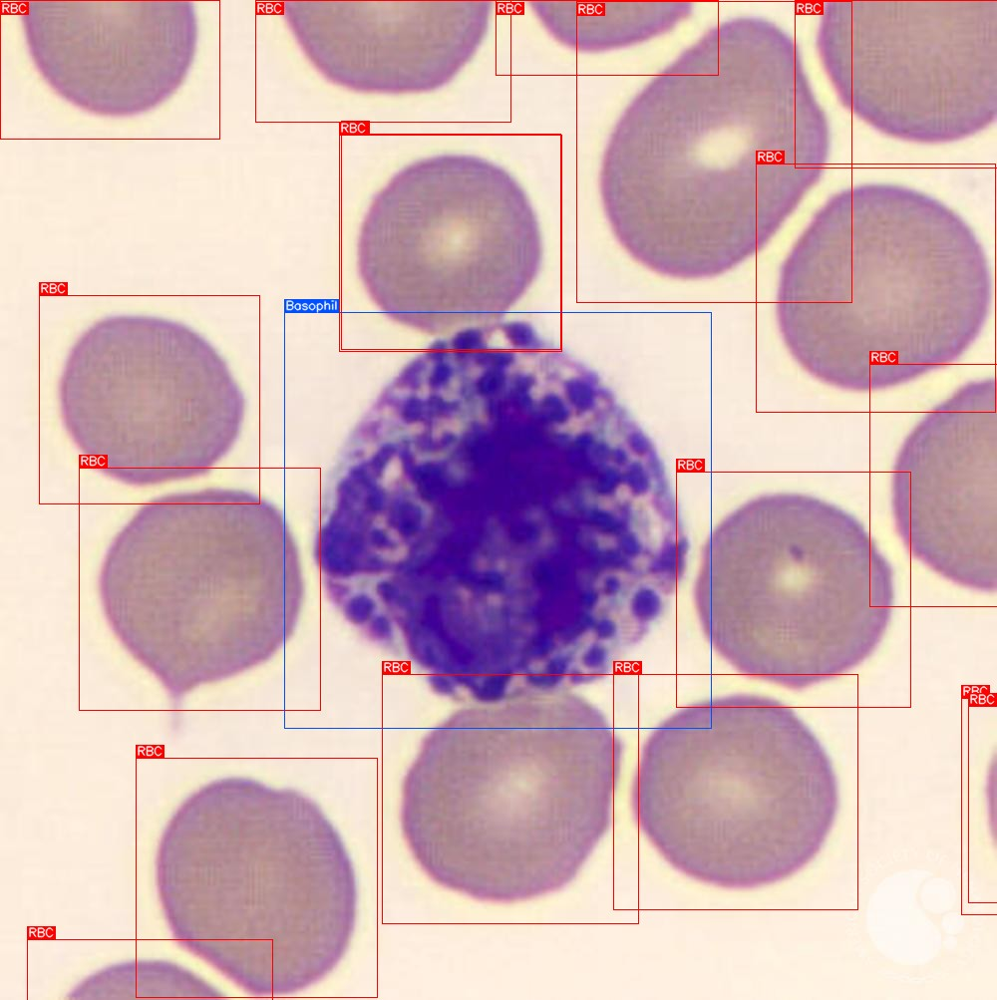

# Blood Detector Model

A YOLO26 object-detection checkpoint fine-tuned to detect and classify cells in peripheral blood smear images.

This repository ships two artifacts:

- **`blood_detector_model.pt`** — the Ultralytics checkpoint, with optimizer/EMA state stripped (≈ 43 MB). It is a complete, self-contained `.pt` (architecture + weights + class names) — no separate config is needed for inference.
- **`blood_detector_metadata.json`** — a sidecar describing the checkpoint without unpickling it: class names, `nc`, model YAML, stride, training args, and the Ultralytics / PyTorch versions used. Useful if you want to rebuild the architecture from scratch or just sanity-check what's inside the weights.

The checkpoint loads directly with `YOLO("blood_detector_model.pt")` — see [Usage](#usage) below.

## Classes (7)

The model predicts axis-aligned bounding boxes for the following classes:

| id | name |
|----|------|
| 0  | RBC (red blood cell) |
| 1  | Platelets |
| 2  | Neutrophil |
| 3  | Lymphocyte |
| 4  | Monocyte |
| 5  | Eosinophil |
| 6  | Basophil |

The five WBC subtypes (Neutrophil → Basophil) cover the standard differential leukocyte count.

## Architecture & training

- **Framework:** [Ultralytics](https://github.com/ultralytics/ultralytics) YOLO26
- **Task:** `detect` (axis-aligned bounding boxes)
- **Input size:** 640 × 640
- **Pipeline:** trained in three stages
  1. Base detector trained on the **TXL-PBC** dataset (RBC / WBC / Platelets, 3 classes).
  2. Fine-tuned on a **granular WBC dataset** (7 classes, WBCs split into the five subtypes via Raabin-WBC crops + auto-labelling) for 80 epochs.
  3. Fine-tuned again on a CVAT-reviewed, expanded dataset (`finetune_v2_dataset`, ~9,000 images: 7,201 train / 1,800 val) for an additional ~22 epochs (early-stopped from a 40-epoch budget, patience = 15).
- **Optimizer:** AdamW (auto), cosine LR schedule, `lr0 = 3e-4`, `lrf = 0.01`, weight decay `5e-4`, warmup 3 epochs.
- **Augmentation:** mosaic, mixup (0.15), copy-paste (0.1, flip), randaugment, HSV jitter, ±15° rotation, horizontal & vertical flips, random erasing (0.4); mosaic disabled for the last 10 epochs.
- **Backbone freeze:** first 10 layers frozen during the final fine-tune.
- **Hardware:** single CUDA GPU, batch size 32, AMP enabled.

## Validation metrics (best epoch)

Reported on the held-out validation split of `finetune_v2_dataset` (1,800 images):

| Metric | Value |
|--------|-------|
| Precision | 0.850 |
| Recall    | 0.848 |
| mAP@50    | 0.875 |
| mAP@50–95 | 0.812 |

(Best epoch by mAP@50–95.)

## Sample predictions

Six smear fields from [test_images/](test_images/) covering all five WBC subtypes, run at `imgsz=640, conf=0.15, iou=0.7`. Box colors: **red** = RBC, **green** = Platelets, **blue** = WBC (any subtype). Annotated outputs in [test_predictions/](test_predictions/).

<table>
<tr>
<td></td>
<td></td>
<td></td>
</tr>
<tr>
<td></td>
<td></td>
<td></td>
</tr>
</table>

### Reproducing these predictions

A small inference script is included: [predict.py](predict.py). It runs the model on every image in `test_images/` and writes annotated outputs to `test_predictions/`.

```bash
pip install ultralytics opencv-python
python predict.py
```

Drop your own smear images into `test_images/` to predict on them too.

## Usage

```bash
pip install ultralytics
```

```python
from ultralytics import YOLO

model = YOLO("blood_detector_model.pt")

# Single image
results = model.predict("smear.jpg", conf=0.25, iou=0.7, imgsz=640)
results[0].show()
results[0].save("smear_pred.jpg")

# Access predictions
for r in results:
    boxes = r.boxes.xyxy.cpu().numpy()      # (N, 4) in pixel coords
    cls   = r.boxes.cls.cpu().numpy().astype(int)
    conf  = r.boxes.conf.cpu().numpy()
    names = [r.names[c] for c in cls]
```

CLI:

```bash
yolo predict model=blood_detector_model.pt source=smear.jpg imgsz=640 conf=0.25
```

## Recommended inference settings

- `imgsz=640` (the model was trained at this resolution; larger sizes also work but are not validated).
- `conf` between **0.20** and **0.35** for general use; raise it to reduce false positives on clean fields, lower it to recover small/faint platelets.
- `iou=0.7` for NMS.
- `max_det=300` is plenty for typical smear fields.

## Intended use & limitations

**Intended use.** Research and prototyping of automated peripheral blood smear analysis: cell counting, WBC differential estimation, dataset pre-labelling, and educational demos.

**Not intended for clinical use.** This model has not been validated as a medical device. Do not use its outputs to inform diagnosis or treatment.

**Known limitations:**
- Trained on Giemsa-stained brightfield smears at standard magnification. Performance will degrade on differently stained slides, phase-contrast images, or unusual magnifications.
- WBC subtype boundaries (especially Monocyte vs. large Lymphocyte, and Basophil, which is rare in the training data) are the hardest classes — expect lower per-class recall there.
- The model detects cells but does not assess morphology, maturity, or pathology beyond the seven categories above.
- Overlapping/clumped cells and out-of-focus regions reduce accuracy.

## Loading notes

The checkpoint is a standard `torch.save` pickle produced by Ultralytics. Loading it:

- requires the `ultralytics` package (the exact version used to train and re-pack the checkpoint is recorded in `blood_detector_metadata.json` under `ultralytics_version_trained` — at the time of release this was `8.4.41`);
- executes Python code on load — only load checkpoints from sources you trust;
- contains the full `nn.Module`, class names, training args, and stride info, so no external config file is needed for inference. The optimizer / EMA state has been stripped (it is irrelevant for inference); training cannot be resumed from this checkpoint, only fine-tuned.

## License

The checkpoint is released under the same terms as the underlying datasets and the Ultralytics framework — review those licenses before commercial use. The training data combines the **TXL-PBC** dataset and the **Raabin-WBC** dataset; both are intended for academic/research use.
